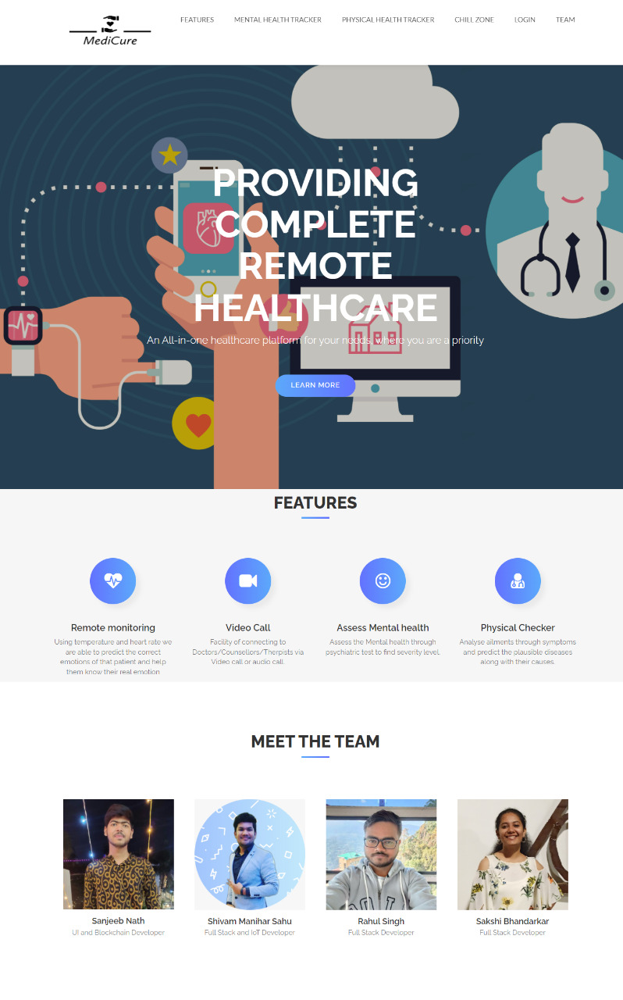
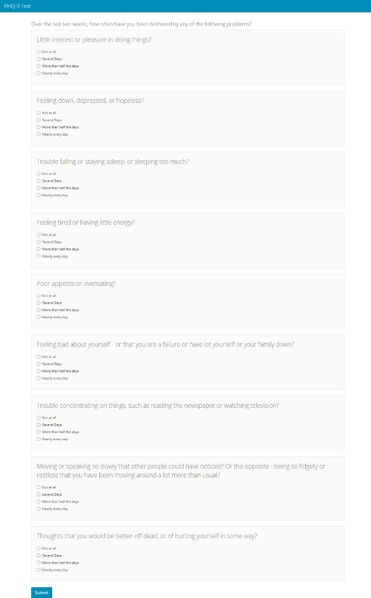
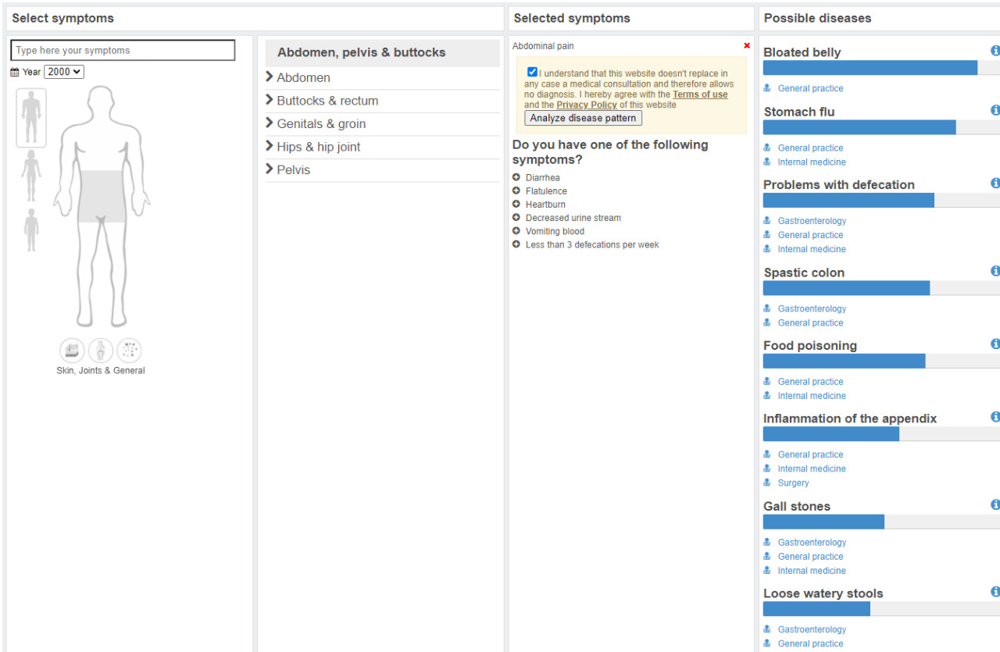
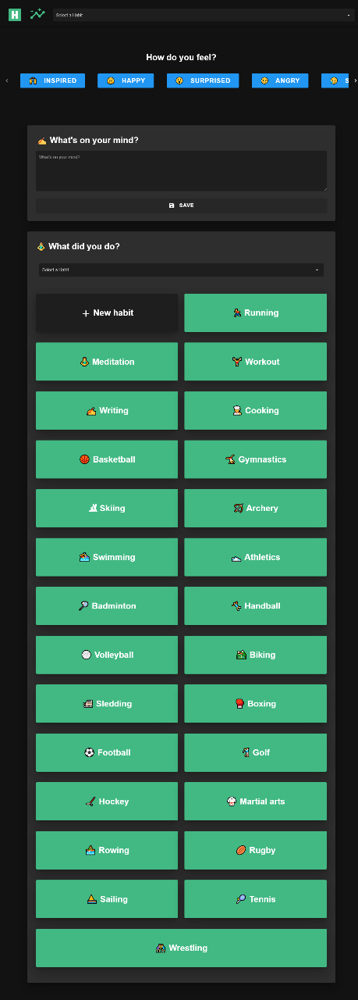
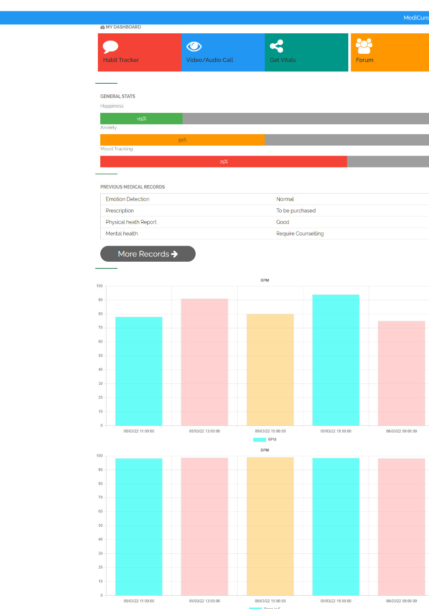

# MediCure

**Solution Presented by Team Eternals**

    
  </a>

## Problem Statement

**Title** – An All-in-one healthcare platform for your needs, where you are a priority.

**Inspiration** - These pandemic times have taught us the importance of a remote healthcare system. Additionally rural areas currently do not have access to good healthcare systems. This has motivated us to build MediCure.

## Solution
We've developed the ***Healthcare Platform*** which is a webapp using **Machine Learning**, and ***maintained relevant information*** on the **ethereum blockchain**, while ***storing the files/reports*** on **IPFS Storage**

| **Technology** | **Tools** |**Usage**|
|----------------|-----------|---------|
|Blockchain| Ethereum, Ganache, Truffle, Metamask, Infura, IPFS | The report files and patient data is stored in IPFS Storage. This IPFS Hash is maintained in the Ethereum Blockchain along with other header information such as patient, data etc. |
|Front-End| React.js, Material UI | This built the web application, the way we see it.| 
|Machine Learning API| Naive Bayes Algorithm, KNN Model, Support Vector Machine, Logistic Regression, Python | Our model has beentrained on Google Collab, and the data classifies the data into categories. We have an accuracy of ~84%|
|IoT| Arduino Uno,Temperature and Heart-beat sensor | Using temperature and heart rate we are able to predict the correct emotions of that patient. Helping them to know their real emotion which can not be predicted by facial expression. The vital signals of the patient can also be used for remote monitoring.
 
## Screenshots

## Team - Eternals

| S. No. 	| Name              	| Semester 	| Role                 |
|--------	|-------------------	|----------	|----------------------|
| 1      	| Shivam Manihar Sahu      	| 8        	| Full Stack & IoT Developer |
| 2      	| Sakshi Bhandarkar 	| 8        	| Full Stack Developer |
| 3      	| Rahul Singh  	| 8        	| Full Stack Developer        |
| 4      	| Sanjeeb Nath      	| 8        	| UI & Blockchain    	   |
